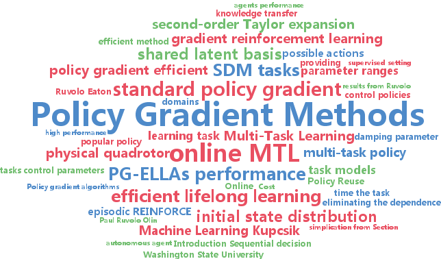

<h1 align=center> REINFORCEMENT LEARNING: FROM BASIC TO ADVANCED</h1>

##  Table of contents

 

<a href="#ref1">Goals?</a>

<a href="#ref2">Requirements?</a>

<a href="#ref3">What is Reinforcement Learning?</a>

<a href="#ref4">Reinforcement Learning Approaches?</a>

<a href="#ref4">Deep Reinforcement Learning?</a>

<a href="#ref6">Research Areas?</a>

<a href="#ref6">Conclusion?</a>

<a href="#ref7">References?</a>

 

# Goals?
You will have learned:
- What Reinforcement Learning is and how it works
- Understanding some ideas and algorithms from basic to advanced
- The challenges in Reinforcement Learning.
- The lecture is designed to non-RL person.

# Requirement?
You should already know:
- Beginner level Python
- Linear Algebra

- Tensorflow (advanced part only)
- Deep learning ((advanced part only))
